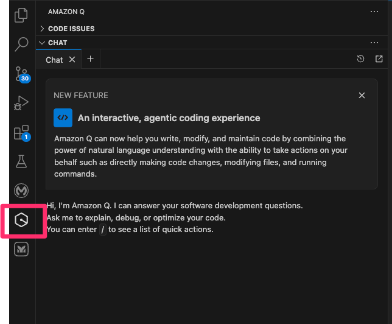
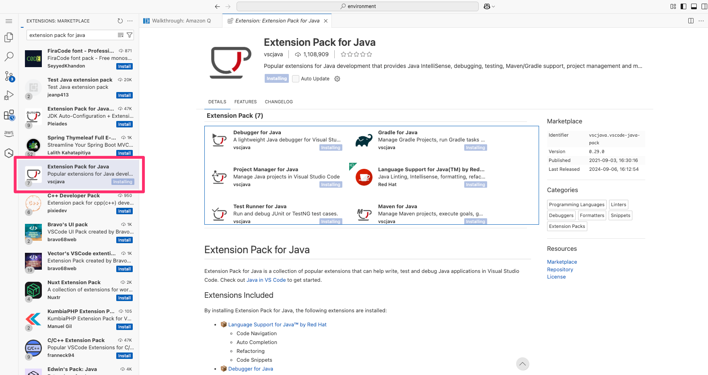
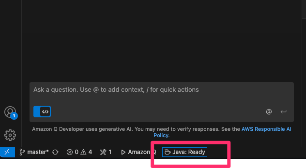
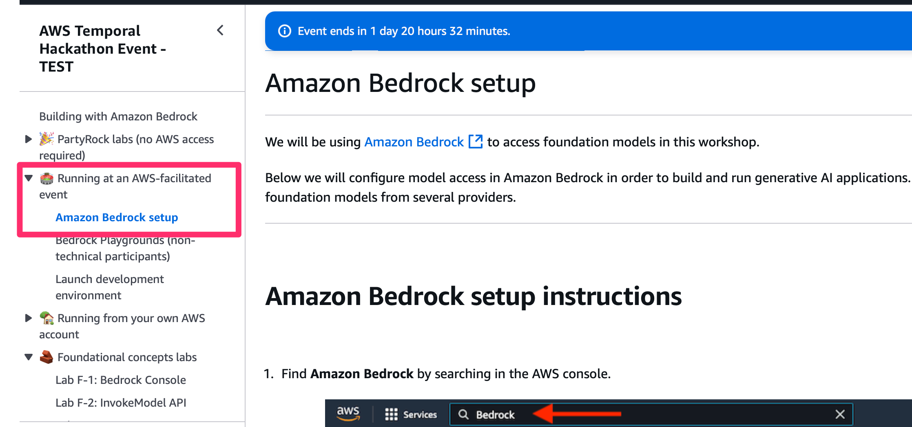
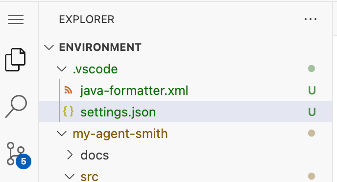

# My Agent Smith Skeleton🕶️

A hands-on hackathon project to explore **Temporal** as a durable workflow engine and its integration with a simple **Java application**. You’ll build and run an agentic workflow in a pre-configured AWS environment using OpenJDK 17, Amazon Bedrock, and Amazon Q.

This setup is intended for experimentation in a Cloud9 or similar AWS-hosted developer workspace.

---

## What does this app do? 🤖

This app simulates an autonomous agent that monitors a target web page and:

* Periodically polls the page
* Detects changes and summarises the differences using **Amazon Bedrock**
* Selects the best communication channel (e.g., Slack, issue tracker)
* Posts a developer-friendly summary of meaningful changes
* *Optional:* Monitors engagement (e.g., reactions, clicks) to optimise future strategy

---

## Pre-Hackathon Checklist ✅

All development will take place in pre-provisioned AWS environments. No local setup is required.

* Confirm you can access: [https://catalog.us-east-1.prod.workshops.aws](https://catalog.us-east-1.prod.workshops.aws)
* Use Chrome or Microsoft Edge
* An event ID will be provided on the day to unlock your environment
* Optional prep: Review the [Temporal 101 course](https://learn.temporal.io/courses/temporal_101/)

---
## Java Setup (OpenJDK 17) ☕

```bash
sudo yum install -y java-17-amazon-corretto-devel
java -version
```

You should see output that starts with `openjdk version "17"`

---

## Temporal Setup (Local Dev) ⏱️

```bash
wget -O temporal_linux_arm64.tar.gz "https://temporal.download/cli/archive/latest?platform=linux&arch=arm64"
tar -xvzf temporal_linux_arm64.tar.gz
./temporal server start-dev --ui-public-path /proxy/8233
```

Then open the UI at:

```
https://<your-cloud9-subdomain>.cloudfront.net/proxy/8233/
```

---

## Amazon Q for Developers Setup 💡

1. Open the extensions sidebar in VS Code
2. Search for `Amazon Q` and install it
3. Complete the sign-in (you may use your AWS Builder profile)
4. Confirm it appears in the sidebar:
   

---

## Install Java Extension Pack

1. Search for `Extension Pack for Java` in VS Code extensions (choose vscjava publisher)
2. Install and verify it by checking for `Java Ready` in the status bar




---

## Enable Access to Amazon Bedrock Models 🔐

1. Follow the instructions for **Amazon Bedrock setup** under "Running at an AWS facilitated event"
2. Request access to the model: `amazon.titan-text-express-v1`



---

## Clone the Skeleton Repo

```bash
git clone https://github.com/sudarshan89/my-agent-smith-skeleton.git
```
---

---
VSCode - This JVM configuration is required to run it reliably on the resource constrained codeserver

Add settings.json

```
Press Ctrl+Shift+P (or Cmd+Shift+P on Mac)
Type and select:
“Preferences: Open Workspace Settings (JSON)”
VS Code will open or create the correct settings.json file for you.
```


```
{
    "files.exclude": {
        "**/.git": true,
        "**/.svn": true,
        "**/.hg": true,
        "**/.DS_Store": true,
        "**/Thumbs.db": true,
        ".mule": true
    },
    "java.compile.nullAnalysis.mode": "automatic",
    "java.jdt.ls.vmargs": "-XX:+UseParallelGC -XX:GCTimeRatio=4 -XX:AdaptiveSizePolicyWeight=90 -XX:ActiveProcessorCount=1 -Dsun.zip.disableMemoryMapping=true -Xmx512m -Xms100m -Xlog:disable",
    "java.format.settings.url": ".vscode/java-formatter.xml"
}

```


---
## Steps to Execute ▶️

1. **Run `WorkerTest`**
   Verifies access to Bedrock and confirms model integration

2. **View in Temporal UI**
   Check workflow status at:

   ```
   https://<your-cloud9-subdomain>.cloudfront.net/proxy/8233/
   ```

---


## Clone the Solution Repo (Optional, but recommended)

Use this repository as your get out of jail card.

```bash
git clone https://github.com/sudarshan89/my-agent-smith.git
```
---

## Prompt Engineering Examples used in this repository ✍️

**Diff summarisation prompt:**

```
Compare the following two versions of content and generate a high-level summary of meaningful differences:
--- PREVIOUS VERSION ---
[previous content]
--- CURRENT VERSION ---
[current content]

Respond in plain English with the key updates developers should know about.
```
---

## Code Repositories 📁

* Java Skeleton Implementation: [GitHub - My Agent Smith (Java)](https://github.com/sudarshan89/my-agent-smith-skeleton)
* Java Full Implementation: [GitHub - My Agent Smith (Java)](https://github.com/sudarshan89/my-agent-smith)
* Python Skeleton Implementation:
[Python Skeleton](https://github.com/taonic/my-agent-smith-python-skeleton)
* Python Full Implementation: [Python implementation](https://github.com/taonic/my-agent-smith-python)

---

## Hackathon 📌
* Use prompt engineering to build out your solution


---

## Sample prompts
* LLMManager.java (invokeBedrock)

```
I’m integrating with Amazon Bedrock using the AWS SDK v2 for Java. Complete invokeBedrock Java method to call amazon.titan-text-express-v1 using BedrockRuntimeClient. The payload is a JSON string, and the response should extract the "outputText" field and return it as a string.
```

* WorkerApp.java (implementation)
```
Generate the main method for a Java class that starts a Temporal worker on the "CONTENT_AMPLIFIER_TASK_QUEUE".

It should:
- Use local stubs and WorkflowClient
- Register ContentAmplifierWorkflowImpl
- Register four activity implementations```
```

* ContentAmplifierWorkflowImpl.java (implementation)

```
Complete the run() method in ContentAmplifierWorkflowImpl to fetch content, detect changes, generate a diff summary, select a channel, and promote the update.
```